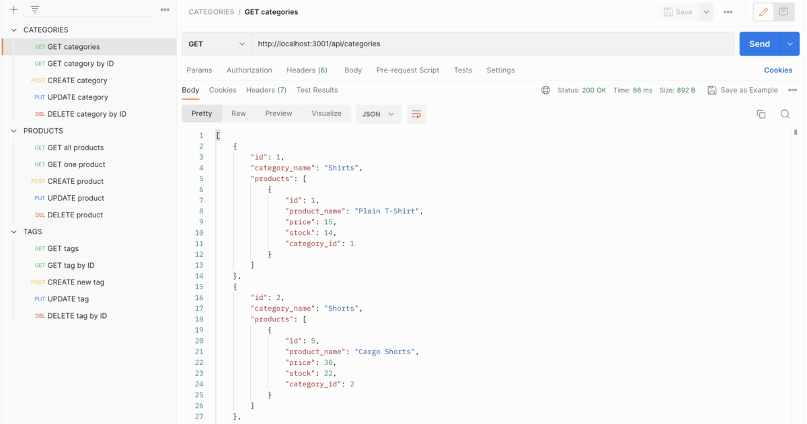
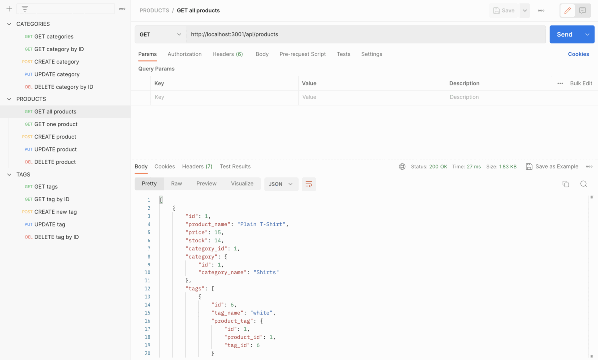
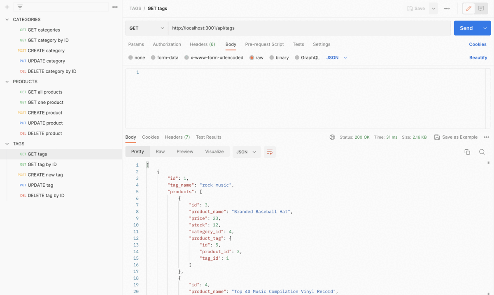

# E-Commerce Back End

[](https://opensource.org/licenses/MIT)

## Description

I have created the back end for an e-commerce site by modifying starter code. I configured a working Express.js API to use Sequelize to interact with a MySQL database.

## Table of Contents

- [Installation](#installation)
- [Usage](#usage)
- [Screenshots](#screenshots)
- [Credits](#credits)
- [License](#license)

## Installation

Ensure that you have Node.js installed, v16 is best. You can follow this guide for installation instructions.

Clone this repository:

```bash
git clone git@github.com:sarasg89/four-commerce-of-the-earth.git
```

Navigate into the directory where you cloned this repository:

```bash
cd ./four-commerce-of-the-earth
```

Run npm install to retrieve dependencies:

```bash
npm install
```

Create a .env file in the root directory and add your MySQL password using this format:

```bash
DB_NAME='ecommerce_db'
DB_PASSWORD=''
DB_USER='root'
```

Create the database and tables using the schema.sql file:

```bash
mysql -u root -p 
mysql> source ./db/schema.sql
```

Seed the database:

```bash
npm run seed
```

## Usage

Start the server:

```bash
node server.js
```

Use Insomnia Core or Postman to test the routes. You can download Insomnia Core [here](https://insomnia.rest/download/) or Postman [here](https://www.postman.com/downloads/).

https://user-images.githubusercontent.com/118869836/227800811-583f6abd-b145-4065-8496-838235b36fcc.mp4

Walkthrough video can be found [here](https://drive.google.com/file/d/1nGc2fybwoZOtVMJrn9M-Cdsp6kT4cEd4/view?usp=share_link).

Test the following routes:

- Categories

GET, PUT, POST and DELETE routes for categories are available at:

```http
http://localhost:3001/api/categories
```

- Products

GET, PUT, POST and DELETE routes for products are available at:

```http
http://localhost:3001/api/products
```

- Tags

GET, PUT, POST and DELETE routes for tags are available at:

```http
http://localhost:3001/api/tags
```

### Screenshots

Categories routes:


Products routes:


Tags routes:


## Credits

Starter code can be found [here](https://github.com/coding-boot-camp/fantastic-umbrella)

Screenshot gifs created with [EzGif](https://ezgif.com/maker)

NPM packages used:

- [mysql2](https://www.npmjs.com/package/mysql2)
- [dotenv](https://www.npmjs.com/package/dotenv)
- [Sequelize](https://www.npmjs.com/package/sequelize)
- [Express](https://www.npmjs.com/package/express)

## License

MIT License

Copyright (c) 2023 sarasg89

Permission is hereby granted, free of charge, to any person obtaining a copy of this software and associated documentation files (the "Software"), to deal in the Software without restriction, including without limitation the rights to use, copy, modify, merge, publish, distribute, sublicense, and/or sell copies of the Software, and to permit persons to whom the Software is furnished to do so, subject to the following conditions:

The above copyright notice and this permission notice shall be included in all copies or substantial portions of the Software.

THE SOFTWARE IS PROVIDED "AS IS", WITHOUT WARRANTY OF ANY KIND, EXPRESS OR IMPLIED, INCLUDING BUT NOT LIMITED TO THE WARRANTIES OF MERCHANTABILITY, FITNESS FOR A PARTICULAR PURPOSE AND NONINFRINGEMENT. IN NO EVENT SHALL THE AUTHORS OR COPYRIGHT HOLDERS BE LIABLE FOR ANY CLAIM, DAMAGES OR OTHER LIABILITY, WHETHER IN AN ACTION OF CONTRACT, TORT OR OTHERWISE, ARISING FROM, OUT OF OR IN CONNECTION WITH THE SOFTWARE OR THE USE OR OTHER DEALINGS IN THE SOFTWARE.
